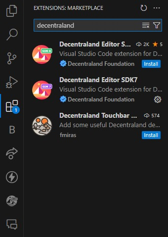
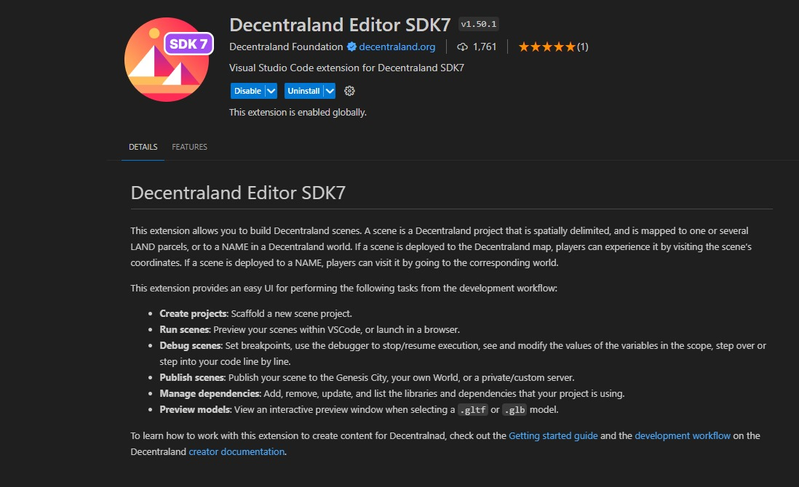
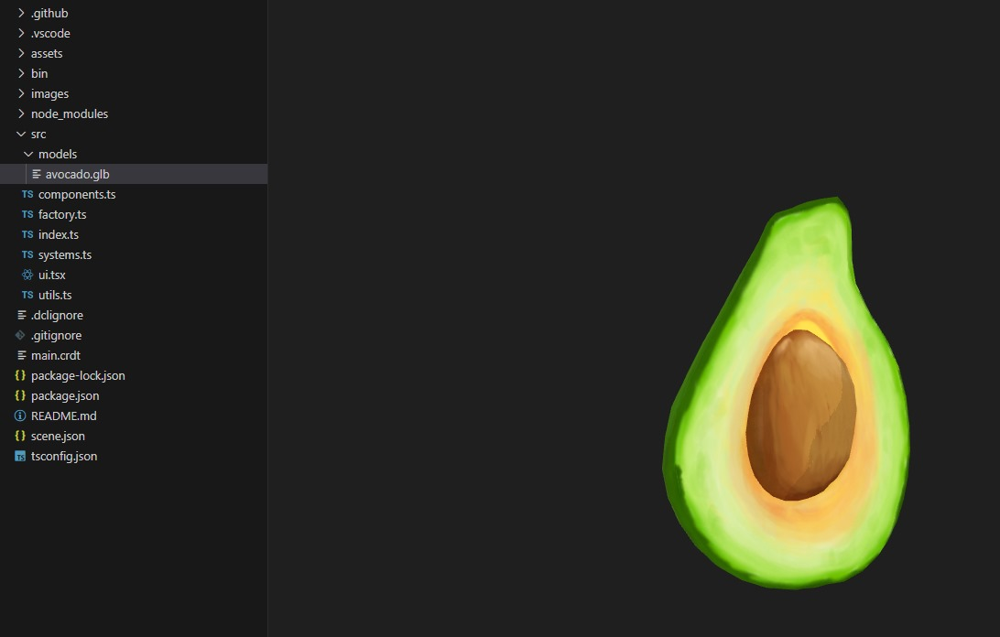
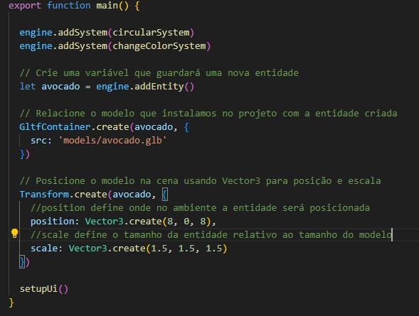
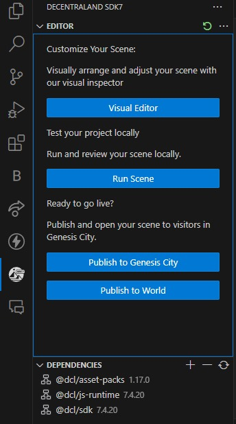
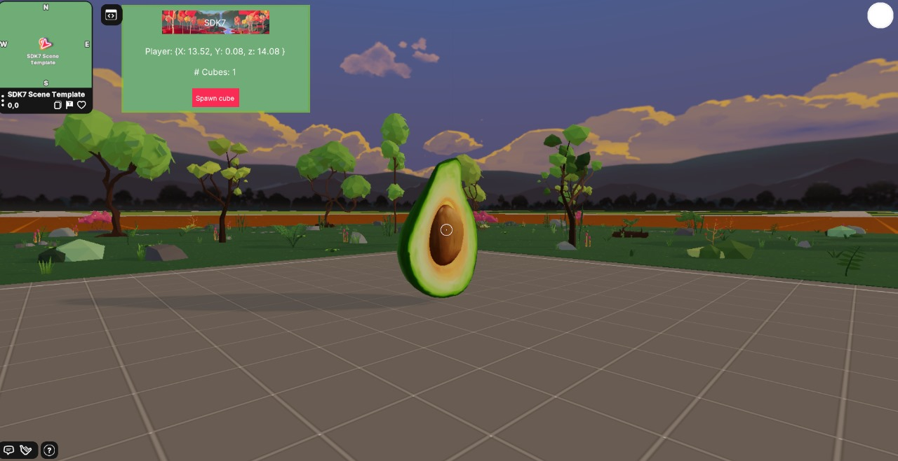

# Setup básico da Decentraland SDK

## Instalando a extensão no VSCODE:

Na aba de extensões do vscode busque por "Decentraland" e instale o "Decentraland Editor SDK7".

Após a instalação, reinicie o vscode.

  
   

## Importando um modelo 3D:

Baixe um modelo demo aqui [Aqui](https://github.com/raulaugusto/Decentraland_Doc/releases/download/model/avocado.glb).

Os modelos devem estar em formato .glb ou .gltf

Na pasta do projeto criado, crie uma pasta 'models' e coloque o arquivo baixado nela.

## Criando entidade na cena:

Na pasta "src" encontre o arquivo "index.ts" e escreva o seguinte código:

Após isso você pode abrir a sua cena no navegador (o Chrome apresenta o melhor desempenho), basta buscar a aba da Decentraland na barra lateral o clicar em "Run Scene"

Então você verá algo parecido com essa cena:

# Teste de interação basica com entrada de usuário
### Vamos fazer com que ao clicar na entidade principal, uma cópia menor dela seja criada ao lado, e que ao clicar a cópia ela seja removida após uma animação

Adicione o seguinte código à função main para adicionar o evento de clique à entidade principal:

